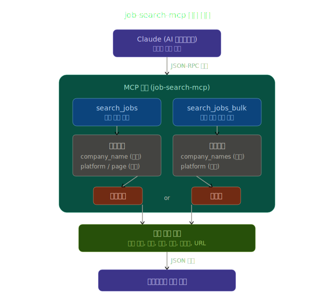

# job-search-mcp

[](LICENSE)
[](https://www.npmjs.com/package/job-search-mcp)
[](https://registry.modelcontextprotocol.io/v0.1/servers/io.github.PJW2004%2Fjob-search/versions/0.0.6)

채용 플랫폼(잡코리아, 사람인)에서 회사명으로 채용공고를 검색하는 MCP 서버입니다.

> [!NOTE] 
> 원티드(Wanted)는 왜 없나요?<br/>
> 원티드는 CDN 레벨에서 자동화 접근을 차단하고 있으며, robots.txt 자체도 403으로 응답합니다.

## 기능

회사명을 입력하면 각 플랫폼에서 채용공고를 수집하여 다음 정보를 반환합니다:

| 항목 | 잡코리아 | 사람인 |
|------|----------|--------|
| 공고 제목 | ✅ | ✅ |
| 회사명 | ✅ | ✅ |
| 경력 | ✅ | ✅ |
| 학력 | ✅ | ✅ |
| 지역 | △ (코드) | ✅ |
| 마감일 | ✅ | ✅ |
| 공고 URL | ✅ | ✅ |

## MCP 도구

### `search_jobs`

채용 플랫폼에서 회사명으로 채용공고를 검색합니다.

#### 파라미터

| 파라미터 | 타입 | 필수 | 기본값 | 설명 |
|----------|------|------|--------|------|
| `company_name` | string | ✅ | - | 검색할 회사명 |
| `platform` | string | - | `"all"` | 검색할 플랫폼 (`jobkorea`, `saramin`, `all`) |
| `page` | number | - | `1` | 페이지 번호 |

### `search_jobs_bulk`

여러 회사의 채용공고를 한 번에 병렬로 검색합니다. `search_jobs`를 반복 호출하는 것보다 훨씬 빠릅니다.

내부적으로 동시성 제한(10개 배치)을 적용하여, 수십~수백 개 회사를 넘겨도 서버가 자동으로 분할 처리합니다. LLM이 여러 번 나눠 호출할 필요 없이 1회 호출로 전체 결과를 받을 수 있습니다.

결과는 임시 디렉토리에 텍스트 파일로 저장되며, 요약과 파일 경로만 반환합니다. LLM이 파일을 읽어 상세 내용을 확인하는 방식으로, 대량 결과에서도 컨텍스트 윈도우를 절약할 수 있습니다.

#### 파라미터

| 파라미터 | 타입 | 필수 | 기본값 | 설명 |
|----------|------|------|--------|------|
| `company_names` | string[] | ✅ | - | 검색할 회사명 목록 |
| `platform` | string | - | `"all"` | 검색할 플랫폼 (`jobkorea`, `saramin`, `all`) |

## 설치

```bash
# pnpm 없는 경우 "npm install -g pnpm"
pnpm install
pnpm build
```

## 사용법

### npx로 실행 (권장)

#### Claude Code

```bash
claude mcp add job-search -- npx -y job-search-mcp
```

#### Claude Desktop

`claude_desktop_config.json`에 추가:

```json
{
  "mcpServers": {
    "job-search": {
      "command": "npx",
      "args": ["-y", "job-search-mcp"]
    }
  }
}
```

### 로컬 빌드로 실행

#### Claude Code

```bash
claude mcp add job-search -- node /path/to/job-search-mcp/dist/index.js
```

#### Claude Desktop

```json
{
  "mcpServers": {
    "job-search": {
      "command": "node",
      "args": ["/path/to/job-search-mcp/dist/index.js"]
    }
  }
}
```

### 질문 예시

```
당근마켓 채용공고 검색해줘
```
```
사람인에서 네이버 채용공고 찾아줘
```

### 일괄 검색 예시

여러 회사의 채용공고를 한 번에 검색할 때 유용합니다. `search_jobs`를 반복 호출하는 것보다 빠릅니다.

```
네이버, 카카오, 라인플러스, 당근마켓, 토스 채용공고를 한 번에 검색해줘.
```

### 대량 검색 성능 테스트 (100개사)

아래 프롬프트를 그대로 붙여넣어 `search_jobs_bulk`의 대량 처리 성능을 테스트할 수 있습니다.

```
다음 100개 회사의 채용공고를 한 번에 검색해줘:
삼성전자, SK하이닉스, LG전자, 현대자동차, 기아, 네이버, 카카오, 쿠팡, 배달의민족, 토스,
당근마켓, 라인플러스, 삼성SDS, LG CNS, SK텔레콤, KT, 현대모비스, 포스코, 한화솔루션, CJ대한통운,
셀트리온, 크래프톤, 넥슨코리아, 엔씨소프트, 넷마블, 스마일게이트, 카카오게임즈, 펄어비스, 컴투스, 데브시스터즈,
야놀자, 직방, 리디, 무신사, 마켓컬리, 오늘의집, 토스증권, 카카오뱅크, 케이뱅크, 비바리퍼블리카,
한글과컴퓨터, 더존비즈온, 안랩, 이스트소프트, 카카오엔터프라이즈, 네이버클라우드, NHN, 우아한형제들, 두나무, 하이브,
롯데정보통신, 신한은행, 하나은행, KB국민은행, 우리은행, 현대카드, 삼성생명, 교보생명, 한화생명, 미래에셋증권,
SK플래닛, 11번가, 위메프, 티몬, SSG닷컴, GS리테일, BGF리테일, 올리브영, 아모레퍼시픽, LG생활건강,
현대건설, 대우건설, GS건설, 삼성물산, SK에코플랜트, 한화건설, 롯데건설, 포스코건설, DL이앤씨, HDC현대산업개발,
CJ ENM, 스튜디오드래곤, 카카오엔터테인먼트, SM엔터테인먼트, JYP엔터테인먼트, YG엔터테인먼트, 넷플릭스코리아, 쿠팡플레이, 왓챠, 티빙,
LG이노텍, 삼성전기, SK실트론, DB하이텍, 한미반도체, 리노공업, 원익IPS, 주성엔지니어링, 코미코, 솔브레인
```

## 아키텍처



- **동시성 제어**: `search_jobs_bulk`는 10개씩 배치로 병렬 요청
- **결과 저장**: 대량 검색 결과는 임시 파일(`%TEMP%/job-search-mcp/`)로 저장하여 컨텍스트 절약
- **타임아웃**: 각 HTTP 요청에 15초 `AbortSignal.timeout` 적용

## 제한사항

- 웹 스크래핑 기반이므로, 잡코리아/사람인의 HTML 구조 변경 시 파싱이 실패할 수 있습니다.
- 짧은 시간에 너무 많은 요청을 보내면 플랫폼 측에서 일시적으로 접근을 차단(rate limit)할 수 있습니다.
- 각 요청에는 15초 타임아웃이 적용되어 있으며, 시간 초과 시 해당 요청은 실패 처리되고 나머지 결과는 정상 반환됩니다.

## 성능 개선 기록

테스트 환경 : 
- 모델 : `Claude Opus 4.6 (1M)`
- 장비 : `Raspberry pi 4 Model B 8GB RAM`
- 네트워크 : `CAT 5E UTP`

| 버전 | 기업(건) | 공고(개) | 소요 시간(MCP) | 소요 시간(총합) | 비고 |
|--|--|--|--|--|--|
| `v0.0.5` | 100 | 5,002 | `maximum allowed tokens` | 3m 18s | 단순 토큰 출력 방식 |
| `v0.0.6` | 100 | 5,002 | 125.7s | 2m 49s | 동시성 제한(10 batch)<br/>파일 저장 방식 |

## 트러블슈팅

### Raspberry Pi 등 저사양 환경에서 MCP 실행이 극도로 느린 경우

**현상**

`search_jobs_bulk`로 대량 검색 시, 로컬 PC에서는 수십 초면 끝나는 작업이 수십 분 이상 걸리거나 응답이 오지 않습니다.

**원인**

`npx -y job-search-mcp` 방식은 매 실행마다 npm registry에서 최신 버전을 확인합니다. Raspberry Pi처럼 네트워크가 느린 환경에서는 이 registry 통신이 병목이 되어, 실제 검색이 시작되기 전에 수 분 이상 지연될 수 있습니다.

```bash
# ss -tnp로 확인하면 npm registry(104.16.x.x)에 연결된 상태로 멈춰있음
ESTAB  0  0  192.168.x.x:41824  104.16.3.34:443  users:(("npm exec job-se",...))
```

**해결**

글로벌 설치로 전환하면 매번 registry를 확인하지 않고 바로 실행됩니다.

```bash
# 글로벌 설치
npm install -g job-search-mcp

# Claude Code MCP 설정 변경
claude mcp remove job-search
claude mcp add job-search -- job-search-mcp
```

## License

MIT License. See [LICENSE](LICENSE) for details.